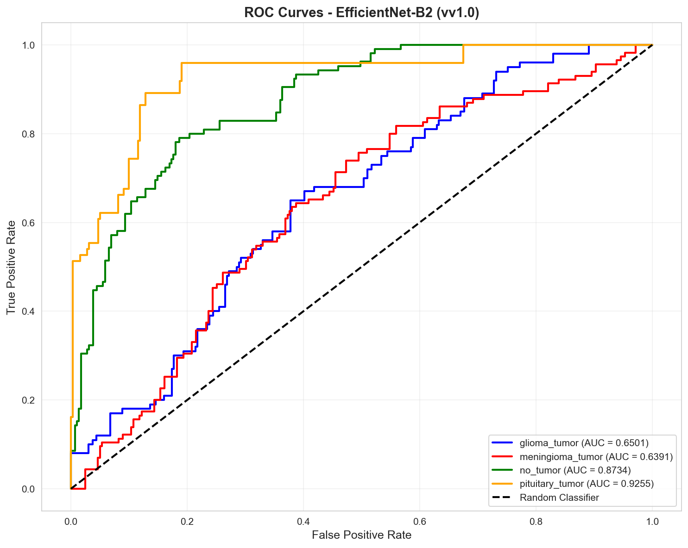

# Brain Tumor Detection (BTD) from MRI Scans

A machine learning and deep learning system for detecting and classifying brain tumors from Magnetic Resonance Imaging (MRI) scans. This project helps clinicians make accurate diagnoses to improve patient survival rates.

## 📋 Project Overview

Brain tumor detection is one of the most challenging tasks in medical imaging applications due to the variability in tumor size, shape, and position across patients. Early and accurate detection is critical, as brain tumors can double in size in just 25 days. This system aims to provide fast and accurate classification of tumors from MRI scans using state-of-the-art ML/DL techniques.

## 🎯 Objectives

- **Primary Goal**: Classify MRI scans as containing tumors or not, and identify tumor types when available
- **Performance**: Achieve high accuracy, precision, recall, and F1-score
- **Clinical Impact**: Support clinicians in making accurate diagnoses for improved patient outcomes

## 📁 Project Structure

```txt
MRI/
├── README.md                 # This file
├── requirements.txt          # Python dependencies
├── docs/                     # Documentation
│   ├── dataset.md           # Dataset information and references
│   ├── requirements.md      # Detailed requirements specification
│   ├── design.md            # ML/DL model design and architecture
│   ├── crisp-dm.md          # CRISP-DM methodology phases
│   ├── evaluation.md        # Evaluation metrics and methodology
│   ├── data_understanding_report.txt  # Data analysis report
│   ├── sample_images.png    # Sample dataset images
│   └── class_distribution.png  # Class distribution visualizations
├── dataset/                  # Dataset directory
│   ├── Training/            # Training images
│   │   ├── glioma_tumor/
│   │   ├── meningioma_tumor/
│   │   ├── no_tumor/
│   │   └── pituitary_tumor/
│   └── Testing/             # Testing images
│       ├── glioma_tumor/
│       ├── meningioma_tumor/
│       ├── no_tumor/
│       └── pituitary_tumor/
├── models/                  # Trained models and checkpoints
│   ├── efficientnet/       # EfficientNet models (B0-B7)
│   │   ├── v1.0/           # Version 1.0 - Initial implementation
│   │   │   ├── efficientnet_b0/
│   │   │   ├── efficientnet_b1/
│   │   │   ├── efficientnet_b2/
│   │   │   ├── efficientnet_b3/
│   │   │   ├── efficientnet_b4/
│   │   │   ├── efficientnet_b5/
│   │   │   ├── efficientnet_b6/
│   │   │   └── efficientnet_b7/
│   │   ├── v1.1/           # Version 1.1 - Hyperparameter tuning
│   │   │   ├── efficientnet_b0/
│   │   │   └── ...
│   │   ├── v1.2/           # Version 1.2 - Data augmentation improvements
│   │   │   └── ...
│   │   ├── v2.0/           # Version 2.0 - Architecture improvements
│   │   │   └── ...
│   │   └── best_models/    # Best performing models from each version
│   ├── custom_cnn/         # Custom CNN architectures
│   │   └── v1.0/
│   └── comparisons/        # Model comparison results
├── src/                     # Source code
│   ├── __init__.py
│   ├── data_loader.py      # Data loading and preprocessing
│   ├── models.py           # Model architectures
│   ├── train.py            # Training scripts
│   ├── evaluate.py         # Evaluation scripts
│   └── utils.py            # Utility functions
├── notebooks/               # Jupyter notebooks for development
│   ├── dataunderstanding.py  # Data understanding analysis
│   ├── data_preparation.ipynb
│   ├── model_training.ipynb
│   └── evaluation.ipynb
├── results/                 # Experiment results and outputs
│   ├── training_logs/      # Training history and logs
│   ├── predictions/        # Model predictions
│   ├── visualizations/     # Training curves, confusion matrices, etc.
│   └── reports/            # Evaluation reports
└── configs/                 # Configuration files
    ├── model_configs.yaml  # Model hyperparameters
    └── training_configs.yaml  # Training configurations
```

## 🔧 Requirements

### System Requirements

- Python 3.7+
- Deep Learning framework: TensorFlow/Keras (for EfficientNet)
- Development platform: Google Colab, Kaggle, or similar
- Sufficient computational resources for training deep learning models
  - GPU recommended for EfficientNet B4-B7
  - Minimum 8GB RAM for EfficientNet B0-B3
  - 16GB+ RAM recommended for EfficientNet B4-B7

### Dataset Requirements

- Labeled MRI brain scan images
- Multiple tumor types (e.g., Glioma, Meningioma, Pituitary)
- Diverse patient demographics (age, gender)
- Recommended sources: Kaggle, medical imaging repositories

## 🚀 Getting Started

### Installation

```bash
# Clone the repository
git clone <repository-url>
cd MRI

# Install dependencies
pip install -r requirements.txt
```

### Dataset Setup

1. Download the dataset from Kaggle or other sources
2. Place the dataset in the `dataset/` directory with `Training/` and `Testing/` subdirectories
3. Ensure proper directory structure with class folders (glioma_tumor, meningioma_tumor, no_tumor, pituitary_tumor)
4. Run data understanding analysis:

   ```bash
   cd notebooks
   python dataunderstanding.py
   ```

### Current Dataset Quality Summary

- **Total images**: 3,264
- **Original split**: 2,870 / 394 (87.9% / 12.1%) - **Too small test set with class disparities**
- **Decision**: Merge Training and Testing datasets due to:
  - **Class disparities**: Uneven class distribution between original splits
  - **Small test set**: Only 12.1% (394 images) insufficient for reliable evaluation
  - **Better control**: Merging allows proper random splitting during training
- **New split strategy**: Random 80% train / 20% validation split during training
  - Random split ensures different train/val distribution each training run
  - Better class balance across splits
  - More reliable model evaluation
- **Class distribution**: glioma 28.37%, meningioma 28.71%, pituitary 27.60%, no_tumor 15.32%
- **Class imbalance**: Yes (no_tumor is smaller) - handled with class weights during training
- **Format**: `.jpg` only, **RGB** only
- **Dimensions**: variable, mostly `512x512` (mean ~`467x470`)
- **Implication**: Dataset size (3,264 images) is optimal for **EfficientNet-B2** (recommended for ~2,500 images, achieves 98-99.5% accuracy on similar MRI datasets)

### Model Setup

The project uses EfficientNet models (B0-B7). Models are automatically downloaded when first used:

```python
# EfficientNet models will be downloaded automatically
from src.models import EfficientNetModel

# Initialize EfficientNet B0
model = EfficientNetModel(version='b0', model_version='v1.0')
```

Models are saved in `models/efficientnet/` with versioning for each improvement iteration.

### Usage

#### Data Understanding

```python
# Analyze the dataset
cd notebooks
python dataunderstanding.py
```

#### Model Training with EfficientNet

```python
# Example: Training EfficientNet B2 (PRIMARY - Version 1.0)
from src.models import EfficientNetTrainer

# Initialize trainer for EfficientNet B2 (PRIMARY - recommended for our dataset size)
trainer = EfficientNetTrainer(
    model_variant='b2',      # PRIMARY: b2 (recommended), b3 (alternative), b4 (experimental)
    version='v1.0',          # Model version for tracking improvements
    dataset_path='../dataset'
)

# Train the model
trainer.train(
    epochs=50,
    batch_size=32,
    learning_rate=1e-4  # Start with 1e-4 for transfer learning (fine-tuning)
)

# Save model
trainer.save_model('models/efficientnet/v1.0/efficientnet_b2/')
```

#### Comparing Different EfficientNet Variants

```python
# Train and compare selected EfficientNet variants
variants = ['b2', 'b3', 'b4']  # B2 (primary), B3 (alternative), B4 (experimental)

for variant in variants:
    trainer = EfficientNetTrainer(
        model_variant=variant,
        version='v1.0',
        dataset_path='../dataset'
    )
    trainer.train()
    trainer.save_model(f'models/efficientnet/v1.0/efficientnet_{variant}/')
```

#### Model Evaluation

```python
# Evaluate a trained model
from src.evaluate import ModelEvaluator

evaluator = ModelEvaluator(
    model_path='models/efficientnet/v1.0/efficientnet_b0/',
    test_data_path='../dataset/Testing'
)

results = evaluator.evaluate()
evaluator.generate_report()
```

## 📊 Methodology

This project follows the **CRISP-DM (Cross-Industry Standard Process for Data Mining)** methodology:

1. **Business Understanding**: Understanding the clinical need for accurate brain tumor detection
2. **Data Understanding**: Exploring MRI scan datasets, understanding image characteristics
3. **Data Preparation**: Preprocessing, augmentation, train/validation/test splits
4. **Modeling**: Designing and implementing ML/DL architectures
5. **Evaluation**: Assessing model performance using multiple metrics
6. **Deployment**: Preparing the system for clinical use

See [docs/crisp-dm.md](docs/crisp-dm.md) for detailed methodology documentation.

## 🏗️ Design

The system uses **EfficientNet** architectures for brain tumor detection and classification. Based on dataset constraints, we selected **3 candidate models**:

### Model Selection Rationale

**Dataset Constraints:**

- **Dataset size**: 3,264 images (between 2,500 and 10k range)
- **Image dimensions**: Mean ~467×470, most common 512×512 (2,341 images)
- **Constraint**: No upscaling desired (input size must be ≤ 512×512)

**Selected Models** (based on research and dataset size):

- **B2 (260×260)**: **PRIMARY** - Recommended for ~2,500 images, achieves 98-99.5% accuracy on similar MRI datasets
- **B3 (300×300)**: **ALTERNATIVE** - Good balance, slightly larger than recommended for dataset size
- **B4 (380×380)**: **EXPERIMENTAL** - Recommended for 10k+ images, may risk overfitting on 3,264 images

**Research-Based Selection Rationale:**

- **B0 (224×224)**: Best for ~400 images (too small for our 3,264)
- **B2 (260×260)**: Optimal for ~2,500 images (matches our dataset size closely)
- **B4 (380×380)**: Recommended for 10k+ images (may be too large, risks overfitting)

**Excluded Models:**

- **B0/B1**: Too small for dataset size
- **B5 (456×456)**: Close to mean image size, but B4 already experimental
- **B6/B7**: Exceed 512×512, would require upscaling

### Model Architecture

- **Selected Models**: EfficientNet B2, B3, B4
  - All models fit within 512×512 images without upscaling
  - Provide good range for comparison (260×260 to 380×380)
  - Appropriate for dataset size (3,264 images)
- **Versioning System**: Each improvement step creates a new version (v1.0, v1.1, v1.2, v2.0, etc.)
- **Model Storage**: All trained models are saved in `models/efficientnet/` with version subdirectories

### Selected EfficientNet Variants

| Model           | Input Size | Parameters | ImageNet Top-1 | MRI Accuracy* | Status        | Selection Reason                    |
| --------------- | ---------- | ---------- | -------------- | ------------- | ------------- | ----------------------------------- |
| EfficientNet-B2 | 260×260    | 9.2M       | 80.1%          | 98-99.5%      | **PRIMARY**    | Recommended for ~2,500 images       |
| EfficientNet-B3 | 300×300    | 12M        | 81.6%          | 98.5%+        | Alternative    | Good balance, slightly larger       |
| EfficientNet-B4 | 380×380    | 19M        | 83.0%          | 98.5%+        | Experimental   | For 10k+ images, may overfit        |

\* *Typical accuracy on similar 4-class brain MRI tumor datasets (glioma/meningioma/pituitary/no-tumor)*

**Recommendation**:

- **Start with EfficientNet-B2** (PRIMARY) - optimally sized for our dataset (3,264 images), achieves 98-99.5% accuracy on similar MRI brain tumor datasets
- **Test EfficientNet-B3** (ALTERNATIVE) - good balance, slightly larger than recommended
- **Experiment with EfficientNet-B4** (EXPERIMENTAL) - may require stronger regularization (higher dropout, lower learning rate) to prevent overfitting on 3,264 images

**Research-Based Guidance**:

- B0: Best for ~400 images (too small for our 3,264)
- B2: Optimal for ~2,500 images (matches our dataset size closely) ✓
- B4: Recommended for 10k+ images (may be too large, requires careful regularization)

### Version History

- **v1.0**: Initial EfficientNet implementation with baseline hyperparameters
  - Default ImageNet weights
  - Standard data augmentation
  - Baseline learning rate and optimizer settings
  
- **v1.1**: Hyperparameter tuning and optimization
  - Learning rate scheduling
  - Optimizer fine-tuning (Adam, SGD with momentum)
  - Batch size optimization
  
- **v1.2**: Data augmentation improvements
  - Advanced augmentation techniques
  - Class balancing strategies
  - Preprocessing pipeline optimization
  
- **v2.0+**: Architecture and training improvements
  - Custom head layers
  - Transfer learning strategies
  - Ensemble methods

### Model Organization

```txt
models/efficientnet/
├── v1.0/                    # Initial versions
│   ├── efficientnet_b0/    # Contains: weights, config, history
│   ├── efficientnet_b1/
│   └── ...
├── v1.1/                    # Improved versions
│   └── ...
├── best_models/             # Best performing models
│   ├── efficientnet_b0_best.h5
│   └── model_comparison.json
└── comparisons/            # Comparison results
    └── efficientnet_comparison.csv
```

### Alternative Models

The system also supports:

- **Custom CNN**: Custom convolutional neural network architectures
- **Transfer Learning**: Pre-trained models (ResNet, VGG) for comparison

All design choices, parameter tuning, and layer-by-layer explanations are documented in [docs/design.md](docs/design.md).

## 📈 Evaluation Metrics

The system is evaluated using:

- **Accuracy**: Overall classification correctness
- **Precision**: True positives / (True positives + False positives)
- **Recall**: True positives / (True positives + False negatives)
- **F1-Score**: Harmonic mean of precision and recall
- **Confusion Matrix**: Detailed classification breakdown
- **ROC-AUC**: Area under ROC curve (model's ability to distinguish classes)
- **Average Precision**: Area under Precision-Recall curve
- **Runtime Performance**: Training and inference times

### Evaluation Visualizations

The evaluation generates comprehensive visualizations:


*Confusion matrix showing classification performance*


*ROC curves for multi-class classification*


*Precision-Recall curves showing precision-recall trade-off*


*Comprehensive metrics summary with overall and per-class metrics*

See [docs/evaluation.md](docs/evaluation.md) for detailed evaluation methodology.

## 📝 Project Phases

### Phase 1: Basic Work

- [ ] Define CRISP-DM methodology phases
- [ ] Select and analyze dataset (type, size, resolution)
- [ ] Implement basic deep learning architecture
- [ ] Document preprocessing operations

### Phase 2: Improvements

- [ ] Experiment with multiple datasets
- [ ] Compare selected EfficientNet models (B2, B3, B4)
- [ ] Fine-tune hyperparameters for each EfficientNet variant
- [ ] Version models (v1.0, v1.1, v1.2, etc.) for each improvement
- [ ] Visualize layer outputs and feature maps
- [ ] Optimize preprocessing pipeline
- [ ] Experiment with different data augmentation strategies

### Phase 3: Evaluation

- [ ] Comprehensive model evaluation
- [ ] Performance comparison across models
- [ ] Documentation and presentation preparation

## 📚 Documentation

- [Requirements Specification](docs/requirements.md)
- [Dataset Information](docs/dataset.md)
- [Design Documentation](docs/design.md)
- [CRISP-DM Methodology](docs/crisp-dm.md)
- [Evaluation Metrics](docs/evaluation.md)

## 👥 Team

This project is developed by a team of 1-3 members following collaborative development practices.

## 📄 License

[Specify license if applicable]

## 🙏 Acknowledgments

- Dataset sources: [Kaggle Brain Tumor Classification](https://www.kaggle.com/sartajbhuvaji/brain-tumor-classification-mri)
- Medical imaging research community
- BADS 2025 course instructors

## 📞 Contact

[Add contact information]

---

**Note**: This project is part of the BADS 2025 Data Science course. The final evaluation includes a 20-minute presentation and code submission.
