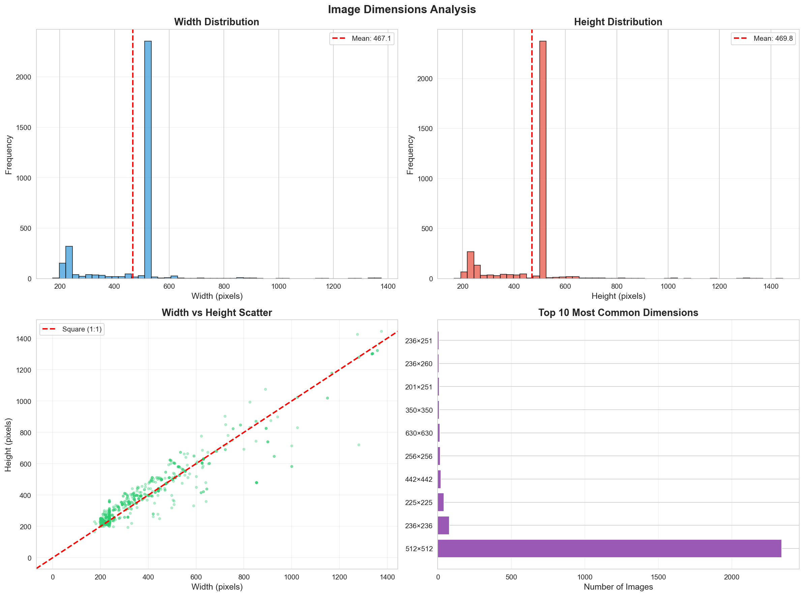
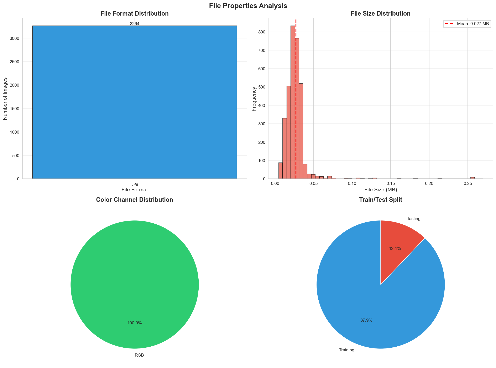
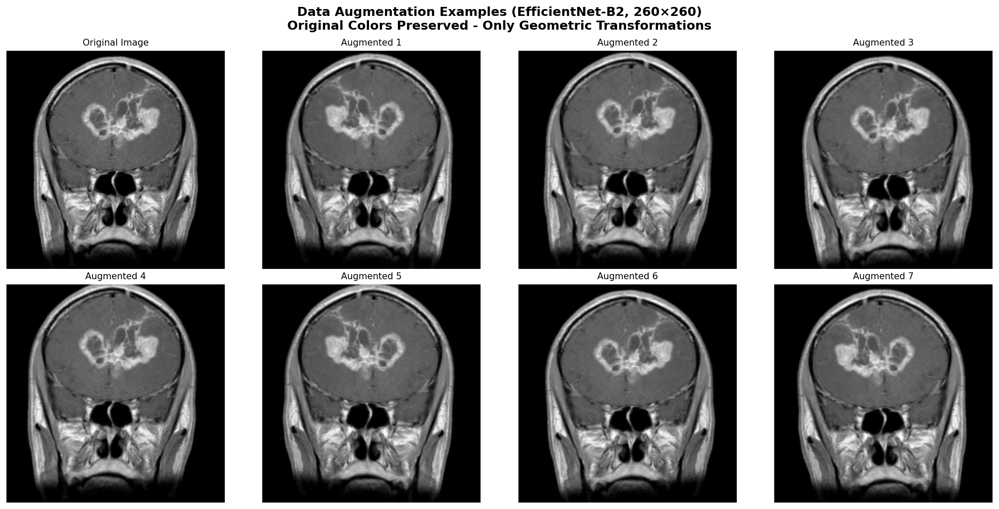
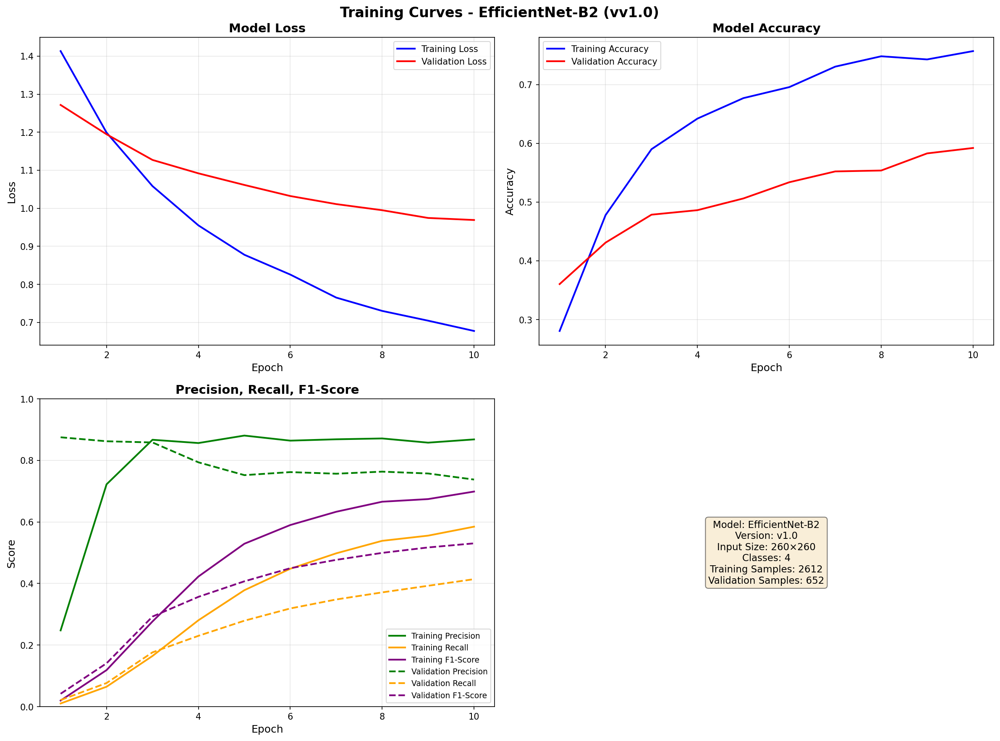

# CRISP-DM Methodology

## Overview

This project follows the **CRISP-DM (Cross-Industry Standard Process for Data Mining)** methodology, a proven framework for data science projects. This document outlines each phase of the methodology as applied to the Brain Tumor Detection system.

## CRISP-DM Phases

```txt
┌─────────────────────────────────────────────────────────┐
│                    CRISP-DM Process                      │
├─────────────────────────────────────────────────────────┤
│                                                           │
│  1. Business Understanding                               │
│         ↓                                                 │
│  2. Data Understanding                                    │
│         ↓                                                 │
│  3. Data Preparation                                      │
│         ↓                                                 │
│  4. Modeling                                             │
│         ↓                                                 │
│  5. Evaluation                                           │
│         ↓                                                 │
│  6. Deployment                                           │
│                                                           │
└─────────────────────────────────────────────────────────┘
```

---

## Phase 1: Business Understanding

### 1.1 Objectives

**Primary Goal**: Develop an accurate Brain Tumor Detection (BTD) system from MRI scans to support clinical decision-making and improve patient survival rates.

**Success Criteria**:

- High accuracy in tumor detection (>90% target)
- Fast inference time for clinical workflow
- Reliable classification of tumor types
- Robust performance across diverse patient demographics

### 1.2 Problem Statement

- **Challenge**: Brain tumors vary significantly in size, shape, and position
- **Urgency**: Tumors can double in size in ~25 days
- **Risk**: Misdiagnosis leads to inappropriate treatment and reduced survival
- **Solution**: Automated ML/DL system for accurate early detection

### 1.3 Requirements

- Binary classification: Tumor / No Tumor
- Multi-class classification: Tumor type identification
- High accuracy, precision, recall, and F1-score
- Fast processing for clinical use

### 1.4 Success Metrics

- Clinical accuracy and reliability
- Processing speed
- Ease of integration into clinical workflow
- Cost-effectiveness

---

## Phase 2: Data Understanding

### 2.1 Data Collection

**Sources**:

- Kaggle: Brain Tumor Classification datasets
- Medical imaging repositories
- Public research datasets

**Dataset Requirements**:

- Labeled MRI brain scan images
- Multiple tumor types (Glioma, Meningioma, Pituitary)
- Diverse patient demographics (age, gender)
- Sufficient size for training and validation

### 2.2 Data Exploration

**Tasks**:

1. **Dataset Statistics**:
   - Total number of images
   - Class distribution
   - Image dimensions and resolutions
   - File formats

2. **Data Quality Assessment**:
   - Missing data
   - Image quality issues
   - Label accuracy
   - Duplicate images

3. **Visualization**:

   The data understanding phase generates comprehensive visualizations:

   
   *Sample images from each class (Training and Testing sets)*

   
   *Class distribution analysis showing image counts and percentages*

   
   *Image dimensions analysis including width/height distributions and most common sizes*

   
   *File properties including formats, sizes, color channels, and train/test split*
   - Sample images from each class
   - Distribution of image sizes
   - Class imbalance analysis
   - Tumor location patterns

4. **Statistical Analysis**:
   - Mean, median, std of image properties
   - Correlation between features
   - Outlier detection

### 2.3 Data Characteristics

**Image Properties**:

- Format: JPEG, PNG, or DICOM
- Resolution: Variable (standardize during preprocessing)
- Color: Grayscale or RGB
- Size: Typically 256x256 or 512x512 pixels

**Class Distribution**:

- Glioma tumors
- Meningioma tumors
- Pituitary tumors
- No tumor (normal)

**Challenges Identified**:

- Class imbalance (if present)
- Image quality variations
- Different scanning protocols
- Tumor size variability

---

## Phase 3: Data Preparation

### 3.1 Data Cleaning

**Steps**:

1. Remove corrupted or unreadable images
2. Handle missing labels
3. Remove duplicates
4. Standardize file formats

### 3.2 Data Preprocessing

**Image Preprocessing Pipeline for EfficientNet**:

1. **Resizing to Model-Specific Square Sizes**:
   - EfficientNet requires square input images
   - Size depends on model variant:
     - B0: 224×224, B1: 240×240, B2: 260×260, B3: 300×300
     - B4: 380×380, B5: 456×456, B6: 528×528, B7: 600×600
   - **Critical**: Use padding (not cropping) to preserve all image data
   - Maintain aspect ratio with center padding to avoid losing tumor regions

2. **Normalization**:
   - Use `tf.keras.applications.efficientnet.preprocess_input()` for proper normalization
   - Ensures compatibility with ImageNet-pretrained weights

3. **Format**:
   - Keep RGB format (dataset is already RGB)
   - No conversion needed

4. **Enhancement** (optional):
   - Contrast adjustment (conservative)
   - Noise reduction if needed
   - Applied carefully to preserve diagnostic quality

**Reference**: [Keras EfficientNet Fine-tuning Guide](https://keras.io/examples/vision/image_classification_efficientnet_fine_tuning/)

**Visualization**:


*Data augmentation examples showing geometric transformations with original colors preserved*

### 3.3 Data Augmentation

**Safe Augmentation Techniques** (applied during training):

**Key Principle**: All augmentations must preserve full image content to avoid losing critical tumor information.

1. **Zoom Out Only** (0.95-1.0 range, very minimal to prevent cropping):
   - Zoom out to add context, never zoom in
   - Prevents cropping of important regions

2. **Translation** (±2% of image size, very conservative to prevent cropping):
   - Very small horizontal/vertical shifts
   - Use black padding (`fill_mode='constant'`, `cval=0.0`) to preserve edges
   - Black padding is natural for MRI (borders are black, skull is grey)

3. **Rotation** (±3 degrees maximum, very conservative to prevent cropping):
   - Very small rotations with padding
   - Avoids corner cropping

4. **Horizontal Flip**:
   - Safe for brain MRI (symmetrical anatomy)
   - No data loss
   - Preserves original colors

**Important: NO Color Adjustments**

- **NO brightness adjustment** - Original MRI colors must be preserved
- **NO contrast adjustment** - Color changes don't reflect real-world MRI scans
- **Only geometric transformations** - Rotation, translation, zoom out, flip
- **Only black padding** - Added during transformations, matches natural MRI borders

**Justification**:

- **Preserves Data**: Zoom out and safe translations ensure no tumor information is lost
- **Preserves Colors**: Original MRI colors are never changed - only geometric transformations
- **Real-World Accuracy**: Color adjustments don't reflect actual MRI scans
- **Increases Diversity**: Geometric augmentation reduces overfitting while maintaining data integrity
- **Medical Imaging Best Practices**: Preserve original diagnostic quality and color characteristics
- **Handles Class Imbalance**: Augmentation helps balance the smaller no_tumor class

### 3.4 Data Splitting

**Decision: Merge Datasets and Use Random Splitting**

**Rationale for Merging**:

1. **Class Disparities**: The original Training/Testing split had uneven class distribution
   - Different proportions of each class in Training vs Testing
   - This can lead to biased model evaluation

2. **Insufficient Test Set**: Original split was 87.9% train / 12.1% test
   - Only 394 images in test set (too small for reliable evaluation)
   - Insufficient for proper model validation

3. **Better Control**: Merging allows us to:
   - Create proper random splits during training
   - Ensure better class balance
   - Use appropriate validation set size

**New Splitting Strategy**:

- **Merge**: Combine `Training/` and `Testing/` folders into unified dataset
- **Random Split**: Use 80% train / 20% validation split during training
  - Split is performed randomly each training run (seed=None for true randomness)
  - Prevents overfitting to specific data distribution
  - More reliable model evaluation

**Benefits**:

- **Better Class Balance**: Random splitting ensures balanced class distribution
- **Appropriate Validation Size**: 20% validation set (vs 12.1% test set)
- **Randomness**: Different split each training run prevents data leakage concerns
- **Flexibility**: Can adjust split ratio as needed (currently 80/20)

**Implementation**:

- Merged dataset stored in `dataset/merged/`
- Random splitting performed during training using `validation_split=0.2`
- Original Testing folder can still be used as separate test set if needed

**Class Imbalance Handling**:

- **Stratified splitting**: Ensures each split has similar class distribution
- **Class weights**: Calculate inverse frequency weights to balance training
- **Augmentation**: Apply targeted augmentation to minority classes if needed

### 3.5 Feature Engineering

**For ML Models**:

- Extract hand-crafted features:
  - Texture features (GLCM, LBP)
  - Shape features
  - Statistical features
  - Histogram features

**For DL Models**:

- Features learned automatically by CNN layers
- May extract features from intermediate layers for analysis

---

## Phase 4: Modeling

### 4.1 Model Selection

**Approaches**:

1. **Deep Learning (Primary)**:
   - Custom CNN architecture
   - Transfer learning (ResNet, VGG, EfficientNet)
   - Hybrid approaches

2. **Machine Learning (Alternative/Comparison)**:
   - SVM with feature extraction
   - Random Forest
   - XGBoost

### 4.2 Model Design

**Architecture Components**:

- Input layer (image dimensions)
- Convolutional blocks (feature extraction)
- Pooling layers (dimensionality reduction)
- Dense layers (classification)
- Output layer (predictions)

**Key Design Decisions**:

- Number of convolutional layers
- Filter sizes and counts
- Activation functions
- Regularization techniques
- Dropout rates

### 4.3 Model Training

**Training Configuration**:

- **Optimizer**: Adam, SGD, or RMSprop
- **Learning Rate**: 1e-4 to 1e-2 (with scheduling)
- **Batch Size**: 32 (adjust based on memory)
- **Epochs**: 20-100 (with early stopping)
- **Loss Function**: Binary or Categorical Cross-Entropy

**Training Process**:

1. Initialize model weights
2. Forward propagation
3. Compute loss
4. Backward propagation
5. Update weights
6. Validate on validation set
7. Repeat until convergence

**Visualizations**:


*Training curves showing loss, accuracy, and learning rate over epochs*


*EfficientNet model architecture diagram showing layer structure*

### 4.4 Hyperparameter Tuning

**Parameters to Tune**:

- Learning rate
- Batch size
- Number of epochs
- Dropout rates
- Regularization strength
- Architecture depth

**Tuning Methods**:

- Grid search
- Random search
- Bayesian optimization
- Manual tuning based on validation performance

### 4.5 Model Comparison

**Compare Multiple Models**:

- Custom CNN vs. Transfer Learning
- Different pre-trained architectures
- ML vs. DL approaches
- Different hyperparameter configurations

**Comparison Metrics**:

- Training/validation accuracy
- Training/validation loss
- Training time
- Model size
- Inference speed

---

## Phase 5: Evaluation

### 5.1 Evaluation Metrics

**Primary Metrics**:

- **Accuracy**: Overall correctness
  - Formula: `(TP + TN) / (TP + TN + FP + FN)`

- **Precision**: True positives / (True positives + False positives)
  - Formula: `TP / (TP + FP)`

- **Recall**: True positives / (True positives + False negatives)
  - Formula: `TP / (TP + FN)`

- **F1-Score**: Harmonic mean of precision and recall
  - Formula: `2 * (Precision * Recall) / (Precision + Recall)`

**Additional Metrics**:

- Confusion Matrix
- ROC Curve and AUC
- Per-class metrics
- Training/validation curves

### 5.2 Evaluation Process

**Steps**:

1. Evaluate on test set (unseen data)
2. Generate confusion matrix
3. Calculate all metrics
4. Analyze per-class performance
5. Visualize results
6. Compare with baseline models

### 5.3 Model Interpretation

**Visualization Techniques**:

- **Layer Outputs**: Visualize feature maps from each layer
- **Grad-CAM**: Highlight regions contributing to predictions
- **Activation Maps**: Show which parts of image activate neurons
- **Training Curves**: Plot loss and accuracy over epochs

### 5.4 Error Analysis

**Analyze**:

- False positives (normal scans classified as tumors)
- False negatives (tumors missed)
- Confusion between tumor types
- Edge cases and difficult examples

### 5.5 Performance Reporting

**Report**:

- Overall metrics (accuracy, precision, recall, F1)
- Per-class performance
- Confusion matrix
- Training time and inference speed
- Model size and complexity

---

## Phase 6: Deployment

### 6.1 Model Finalization

**Tasks**:

- Select best-performing model
- Final training on combined train+validation sets
- Save model weights and architecture
- Create inference pipeline

### 6.2 System Integration

**Components**:

- Input interface (image upload/loading)
- Preprocessing pipeline
- Model inference
- Output formatting (diagnosis + confidence)

### 6.3 Documentation

**Deliverables**:

- Code documentation
- Model architecture documentation
- Usage instructions
- Performance reports
- Presentation materials

### 6.4 Presentation

**Content** (20 minutes):

1. Project overview and objectives
2. Work distribution among team members
3. Methodology (CRISP-DM phases)
4. Dataset description
5. Model design and architecture
6. Results and evaluation
7. Challenges encountered
8. Live system demonstration
9. Q&A

### 6.5 Future Improvements

**Potential Enhancements**:

- Ensemble methods
- 3D CNN for volumetric data
- Multi-modal learning
- Real-time inference optimization
- Integration with hospital systems

---

## Iterative Process

CRISP-DM is an iterative methodology. The process may cycle back to earlier phases based on findings:

- **Data Understanding → Data Preparation**: Refine preprocessing based on insights
- **Modeling → Data Preparation**: Adjust augmentation or preprocessing
- **Evaluation → Modeling**: Tune hyperparameters or try different architectures
- **Evaluation → Data Understanding**: Collect more data if needed

---

## Project Timeline

1. **Week 1-2**: Business Understanding + Data Understanding
2. **Week 3-4**: Data Preparation + Initial Modeling
3. **Week 5-6**: Model Training + Hyperparameter Tuning
4. **Week 7-8**: Evaluation + Documentation
5. **Week 9**: Finalization + Presentation Preparation

---

## Team Responsibilities

**Suggested Distribution**:

- **Member 1**: Data Understanding + Data Preparation
- **Member 2**: Modeling + Training
- **Member 3**: Evaluation + Documentation

*Note: All members should contribute to all phases, but may have primary responsibilities*
