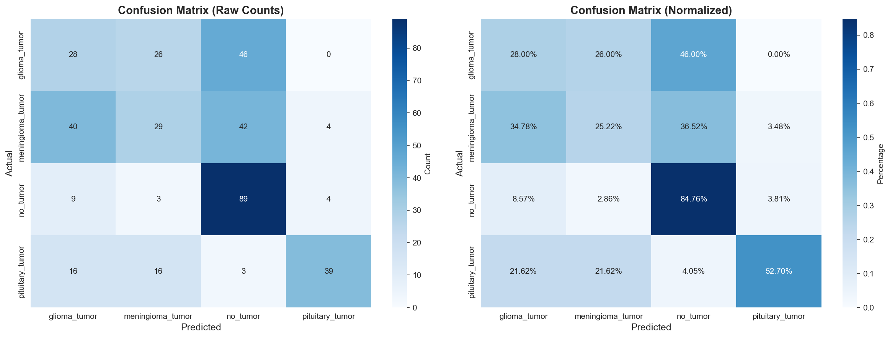
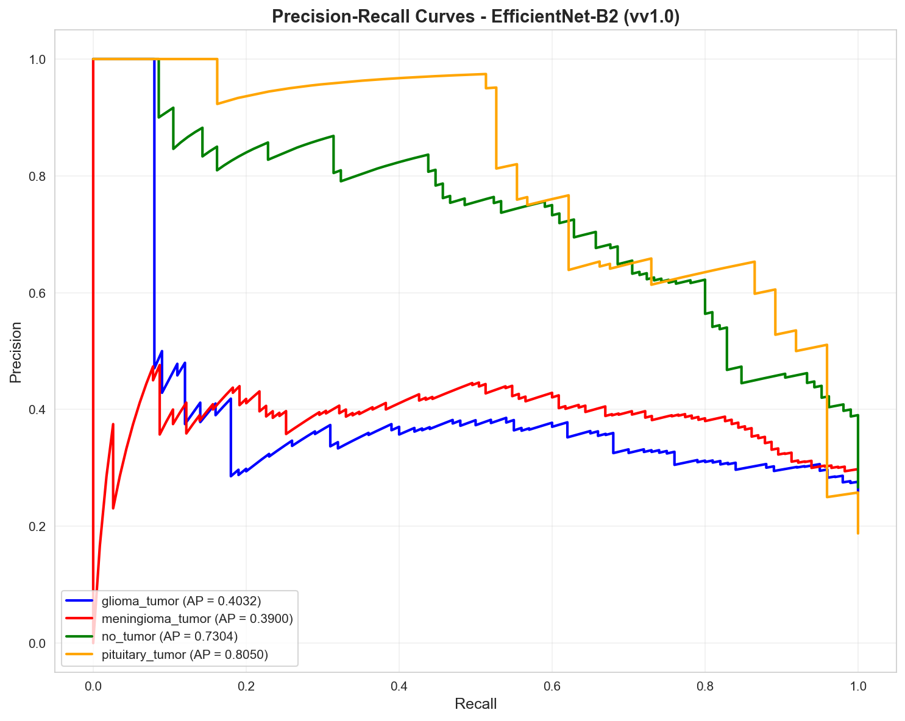
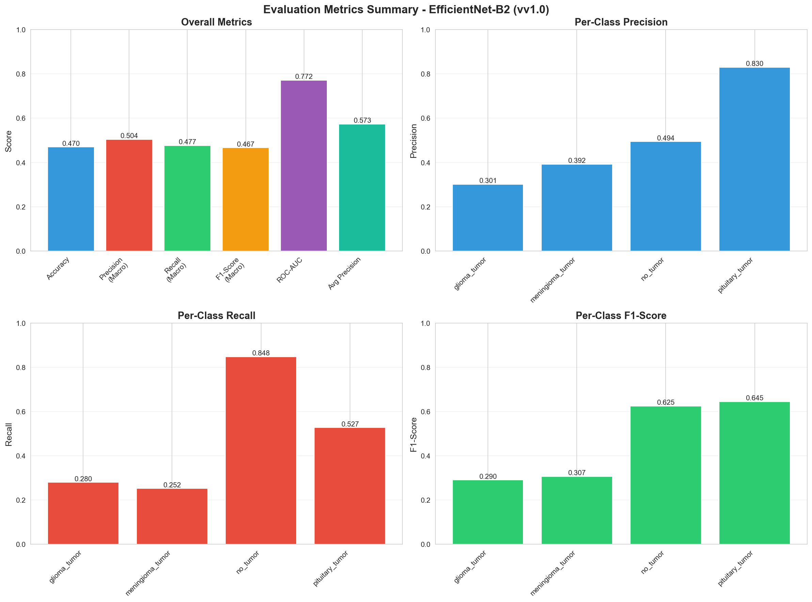

# Evaluation Methodology

## Overview

This document describes the comprehensive evaluation methodology for the Brain Tumor Detection (BTD) system. The evaluation covers multiple metrics, visualization techniques, and performance analysis methods.

## 1. Evaluation Metrics

### 1.1 Primary Metrics

#### Accuracy

**Definition**: Overall correctness of the classification model.

**Formula**:

```txt
Accuracy = (TP + TN) / (TP + TN + FP + FN)
```

**Where**:

- **TP (True Positives)**: Correctly predicted tumors
- **TN (True Negatives)**: Correctly predicted no tumors
- **FP (False Positives)**: Normal scans incorrectly classified as tumors
- **FN (False Negatives)**: Tumors incorrectly classified as normal

**Interpretation**:

- Range: 0 to 1 (or 0% to 100%)
- Higher is better
- Best when classes are balanced

**Limitations**:

- Can be misleading with imbalanced datasets
- Doesn't distinguish between types of errors

#### Precision

**Definition**: Proportion of positive predictions that are actually correct.

**Formula**:

```
Precision = TP / (TP + FP)
```

**Interpretation**:

- Range: 0 to 1
- Higher is better
- Measures: "Of all predicted tumors, how many are actually tumors?"
- Important when false positives are costly (unnecessary treatments)

**Clinical Significance**:

- High precision means fewer false alarms
- Reduces unnecessary medical interventions

#### Recall (Sensitivity)

**Definition**: Proportion of actual positives that are correctly identified.

**Formula**:

```
Recall = TP / (TP + FN)
```

**Interpretation**:

- Range: 0 to 1
- Higher is better
- Measures: "Of all actual tumors, how many did we find?"
- Important when false negatives are costly (missed tumors)

**Clinical Significance**:

- High recall means fewer missed tumors
- Critical for early detection and patient survival

#### F1-Score

**Definition**: Harmonic mean of precision and recall, providing a balanced metric.

**Formula**:

```
F1-Score = 2 * (Precision * Recall) / (Precision + Recall)
```

**Interpretation**:

- Range: 0 to 1
- Higher is better
- Balances precision and recall
- Useful when both metrics are important

**When to Use**:

- When you need a single metric balancing precision and recall
- When classes are imbalanced
- When both false positives and false negatives matter

### 1.2 Multi-Class Metrics

For multi-class classification (Glioma, Meningioma, Pituitary, No Tumor):

#### Macro-Averaged Metrics

- Calculate metric for each class
- Average across all classes
- Treats all classes equally

#### Micro-Averaged Metrics

- Aggregate all TP, FP, FN across classes
- Calculate single metric
- Weighted by class frequency

#### Weighted-Averaged Metrics

- Average metrics weighted by class support
- Accounts for class imbalance

### 1.3 Additional Metrics

#### Specificity

**Definition**: Proportion of actual negatives correctly identified.

**Formula**:

```
Specificity = TN / (TN + FP)
```

**Interpretation**:

- Measures ability to correctly identify normal scans
- Important for reducing false alarms

#### ROC-AUC (Receiver Operating Characteristic - Area Under Curve)

**Definition**: Area under the ROC curve, measuring model's ability to distinguish between classes.

**Interpretation**:

- Range: 0 to 1
- 0.5 = Random classifier
- 1.0 = Perfect classifier
- >0.9 = Excellent performance

#### PR-AUC (Precision-Recall AUC)

**Definition**: Area under the Precision-Recall curve.

**When to Use**:

- Better than ROC-AUC for imbalanced datasets
- Focuses on positive class performance

## 2. Confusion Matrix

### 2.1 Binary Classification

```
                Predicted
              Tumor  No Tumor
Actual Tumor    TP      FN
No Tumor        FP      TN
```

### 2.2 Multi-Class Classification

```
                Predicted
              Glioma  Meningioma  Pituitary  No Tumor
Glioma          ...      ...        ...        ...
Meningioma      ...      ...        ...        ...
Pituitary       ...      ...        ...        ...
No Tumor        ...      ...        ...        ...
```

### 2.3 Visualization

The evaluation script generates comprehensive confusion matrix visualizations:


*Confusion matrix showing raw counts and normalized percentages for all classes*

**Features**:

- Heatmap visualization with color coding
- Normalized confusion matrix (percentages)
- Raw counts confusion matrix
- Per-class accuracy from diagonal

### 2.4 Analysis

**From Confusion Matrix, Identify**:

- Which classes are confused with each other
- Most common misclassifications
- Per-class precision and recall
- Overall accuracy

## 3. Performance Visualization

### 3.1 Training Curves

**Plots to Generate**:

1. **Training vs. Validation Loss**
   - X-axis: Epochs
   - Y-axis: Loss
   - Shows overfitting (gap between curves)

2. **Training vs. Validation Accuracy**
   - X-axis: Epochs
   - Y-axis: Accuracy
   - Shows learning progress

**Analysis**:

- Convergence: When curves plateau
- Overfitting: Large gap between train and validation
- Underfitting: Both curves remain low

### 3.2 ROC Curve

**Plot**:

- X-axis: False Positive Rate (1 - Specificity)
- Y-axis: True Positive Rate (Recall)
- Diagonal line: Random classifier baseline

**Interpretation**:

- Curve closer to top-left = Better model
- AUC value summarizes performance

### 3.3 Precision-Recall Curve

**Plot**:

- X-axis: Recall
- Y-axis: Precision
- Shows trade-off between precision and recall

**Use When**:

- Imbalanced datasets
- Focus on positive class performance

**Visualization**:


*Precision-Recall curves for each class showing the precision-recall trade-off*

### 3.4 Learning Curves

**Plot**:

- X-axis: Training set size
- Y-axis: Score (accuracy/loss)
- Shows model's learning capacity

**Analysis**:

- High bias: Both curves converge at low score
- High variance: Large gap between curves

## 4. Runtime Performance

### 4.1 Training Time

**Metrics**:

- Total training time
- Time per epoch
- Time per batch

**Factors**:

- Model complexity
- Dataset size
- Hardware (CPU/GPU)
- Batch size

### 4.2 Inference Time

**Metrics**:

- Time per image
- Images per second
- Batch inference time

**Clinical Importance**:

- Fast inference enables real-time diagnosis
- Target: <1 second per image

### 4.3 Resource Usage

**Metrics**:

- Memory usage (RAM/VRAM)
- CPU/GPU utilization
- Model size (MB/GB)

## 5. Metrics Summary Visualization

The evaluation generates a comprehensive metrics summary visualization:


*Comprehensive metrics summary including overall metrics (accuracy, precision, recall, F1-score, ROC-AUC, Average Precision) and per-class performance (precision, recall, F1-score for each class)*

**Components**:

- Overall metrics bar chart (accuracy, precision, recall, F1-score, ROC-AUC, Average Precision)
- Per-class precision bar chart
- Per-class recall bar chart
- Per-class F1-score bar chart

## 6. Model Comparison

### 6.1 Comparison Table

| Model | Accuracy | Precision | Recall | F1-Score | Training Time | Inference Time |
|-------|----------|-----------|--------|----------|---------------|----------------|
| Custom CNN | ... | ... | ... | ... | ... | ... |
| ResNet50 | ... | ... | ... | ... | ... | ... |
| VGG16 | ... | ... | ... | ... | ... | ... |
| EfficientNet | ... | ... | ... | ... | ... | ... |

### 5.2 Statistical Significance

**Tests**:

- Paired t-test for model comparison
- Confidence intervals for metrics
- Cross-validation for robust estimates

## 6. Error Analysis

### 6.1 False Positives Analysis

**Questions**:

- What characteristics do false positives share?
- Are there patterns in misclassified normal scans?
- Can preprocessing improve these cases?

**Actions**:

- Visualize false positive examples
- Analyze image properties
- Adjust decision threshold if needed

### 7.2 False Negatives Analysis

**Questions**:

- Which tumor types are most often missed?
- Are small tumors harder to detect?
- Are there image quality issues?

**Actions**:

- Visualize false negative examples
- Analyze tumor characteristics
- Consider data augmentation for rare cases

### 7.3 Confusion Analysis

**For Multi-Class**:

- Which classes are most confused?
- Are there similar-looking tumor types?
- Can we improve feature extraction?

## 8. Layer Visualization

### 8.1 Feature Maps

**Visualization**:

- Output of each convolutional layer
- Show what features the model learns
- Identify which layers detect edges, textures, patterns

**Purpose**:

- Understand model behavior
- Debug architecture choices
- Explain predictions

### 7.2 Grad-CAM (Gradient-weighted Class Activation Mapping)

**Purpose**:

- Highlight image regions contributing to predictions
- Show where the model "looks" for tumors
- Provide interpretability

**Visualization**:

- Overlay heatmap on original image
- Red regions = High importance
- Blue regions = Low importance

### 7.3 Activation Patterns

**Analysis**:

- Which neurons activate for which tumor types?
- Are there specialized feature detectors?
- How do activations differ between classes?

## 9. Cross-Validation

### 9.1 K-Fold Cross-Validation

**Method**:

- Split data into k folds
- Train on k-1 folds, validate on 1 fold
- Repeat k times
- Average results

**Benefits**:

- More robust performance estimates
- Better use of limited data
- Reduces variance in evaluation

### 9.2 Stratified K-Fold

**When to Use**:

- Imbalanced datasets
- Maintains class distribution in each fold

## 10. Evaluation Report Template

### 10.1 Report Structure

1. **Executive Summary**
   - Overall performance
   - Best model selection
   - Key findings

2. **Methodology**
   - Evaluation approach
   - Metrics used
   - Data splits

3. **Results**
   - All metrics for each model
   - Confusion matrices
   - Performance curves

4. **Analysis**
   - Model comparison
   - Error analysis
   - Strengths and weaknesses

5. **Visualizations**
   - Training curves
   - Confusion matrices
   - ROC/PR curves
   - Sample predictions

6. **Conclusions**
   - Best performing model
   - Recommendations
   - Future improvements

## 11. Evaluation Checklist

- [ ] Calculate all primary metrics (Accuracy, Precision, Recall, F1)
- [ ] Generate confusion matrix
- [ ] Plot training/validation curves
- [ ] Calculate ROC-AUC and PR-AUC
- [ ] Measure training and inference times
- [ ] Compare multiple models
- [ ] Perform error analysis
- [ ] Visualize layer outputs
- [ ] Generate Grad-CAM visualizations
- [ ] Create comprehensive evaluation report
- [ ] Document all findings

## 11. Target Performance

### 11.1 Minimum Acceptable

- Accuracy: >85%
- Precision: >80%
- Recall: >80%
- F1-Score: >80%

### 11.2 Good Performance

- Accuracy: >90%
- Precision: >85%
- Recall: >85%
- F1-Score: >85%

### 11.3 Excellent Performance

- Accuracy: >95%
- Precision: >90%
- Recall: >90%
- F1-Score: >90%

*Note: Targets may vary based on dataset characteristics and clinical requirements*
